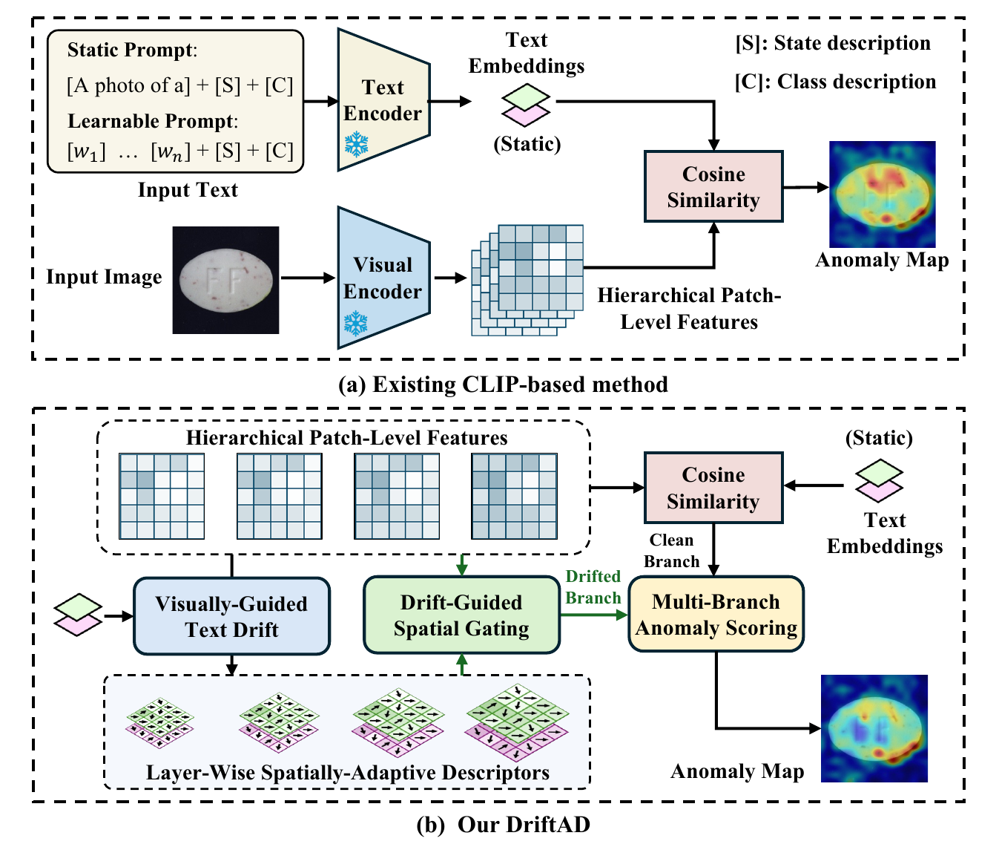
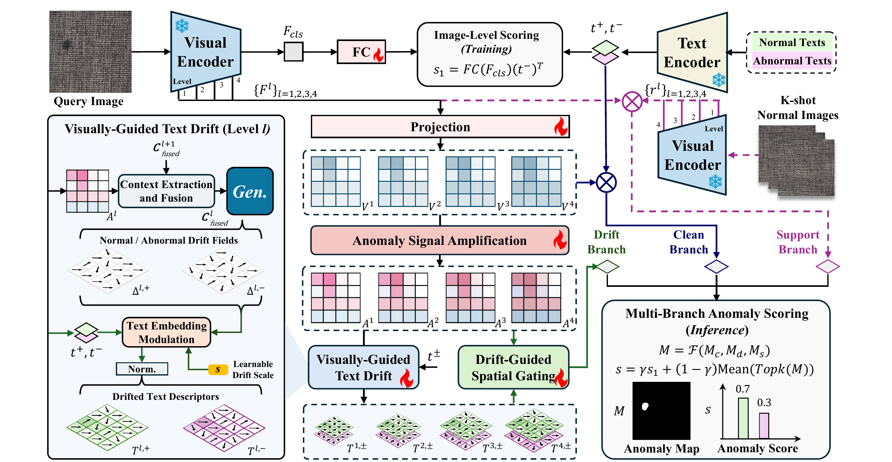

# DriftAD: Visually-Guided Text Drift for Few-Shot Industrial Anomaly Detection

Official implementation of **"DriftAD: Visually-Guided Text Drift for Few-Shot Industrial Anomaly Detection"**, ACM MM 2026.

Wenyang Liu, Tianyi Liu, Dongshuo Zhang, Kejun Wu, Adams Wai-Kin Kong

## Motivation

<p align="center"></p>

Existing approaches mainly rely on globally shared, static text representations (even when utilizing
prompt-tuning), inherently restricting their sensitivity to localized defects. DriftAD treats these static
representations strictly as initial anchors. By incorporating local visual context, it dynamically drifts these
anchors into layer-wise, spatially-adaptive anomaly descriptors, achieving significantly sharper and more
precise anomaly maps.

## Method

<p align="center"></p>

Given a query image, the frozen image encoder extracts multi-level patch features and a CLS token, which are
projected into scale-aware features and enhanced by **Anomaly Signal Amplification**. **Visually-Guided Text
Drift** conditions spatially-varying drift fields on these features to transform frozen text embeddings into
layer-wise, spatially-adaptive anomaly descriptors. **Drift-Guided Spatial Gating** then uses the drifted
abnormal descriptor as a spatial probe to enhance anomaly-relevant regions. **Multi-Branch Anomaly Scoring**
fuses three complementary branches to produce the final anomaly map and score.

## Results

**AUROC / pAUROC**

| Dataset | 1-shot | 2-shot | 4-shot |
| --- | --- | --- | --- |
| MVTec-AD | 97.2 / 96.8 | 97.7 / 97.0 | 98.0 / 97.2 |
| VisA | 93.1 / 97.4 | 93.3 / 97.8 | 94.0 / 98.0 |

**AUPR / PRO**

| Dataset | 1-shot | 2-shot | 4-shot |
| --- | --- | --- | --- |
| MVTec-AD | 98.8 / 92.2 | 99.0 / 92.6 | 99.2 / 92.7 |
| VisA | 94.8 / 86.7 | 95.0 / 87.8 | 95.3 / 88.3 |

## Installation

```bash
conda create -n driftad python=3.9 -y
conda activate driftad
pip install -r requirements.txt
```

## Data and checkpoints

Download [MVTec-AD](https://www.mvtec.com/company/research/datasets/mvtec-ad/downloads) and
[VisA](https://github.com/amazon-science/spot-diff), then place or symlink them under `data/`:

```
data/
├── mvtec/          # bottle/ cable/ capsule/ ...
└── visa/           # candle/ capsules/ ... and split_csv/1cls.csv
```

Other layouts work via `MVTEC_ROOT` / `VISA_ROOT` (paths are relative to `code/`).

DriftAD uses the frozen OpenCLIP ViT-H/14 encoders shipped with ImageBind-H. Download `imagebind_huge.pth`
([link](https://drive.google.com/file/d/1jLpa_YCL_bOHtSZ1FpZygfQFHJOrWe71/view?usp=drive_link)) into
`pretrained_ckpt/imagebind_ckpt/`.

Download the released checkpoints and place them as:

```
code/ckpt/train_mvtec/train_on_mvtec.pt      # reproduces the MVTec-AD rows
code/ckpt/train_visa/train_on_visa.pt        # reproduces the VisA rows
```

| Checkpoint | Download | Size | MD5 |
| --- | --- | --- | --- |
| `train_on_mvtec.pt` | [link](https://drive.google.com/file/d/1Ugh5Jwa6hGprzoqkhzntM5KNe9GmShcp/view?usp=sharing) | 490 MB | `7d130654f0c462b523a4cd9bc329bdaf` |
| `train_on_visa.pt` | [link](https://drive.google.com/file/d/1GPDGSAjodAombDZBKhKR0A7ftGM0B9aK/view?usp=sharing) | 490 MB | `fff94c1e6eeb7092b7fbf1939a33e0e4` |

These are the default paths of `test_mvtec.py` / `test_visa.py`, so no `--ckpt` flag is needed.

## Usage

```bash
bash code/scripts/train_mvtec.sh    # train on MVTec-AD
bash code/scripts/train_visa.sh     # train on VisA

bash code/scripts/test_mvtec.sh     # 1-/2-/4-shot on MVTec-AD
bash code/scripts/test_visa.sh      # 1-/2-/4-shot on VisA
```

Or a single setting:

```bash
cd code
python test_mvtec.py --k_shot 1
python test_visa.py  --k_shot 1 --round 14
```

## Citation

```bibtex
@inproceedings{liu2026driftad,
  title     = {DriftAD: Visually-Guided Text Drift for Few-Shot Industrial Anomaly Detection},
  author    = {Liu, Wenyang and Liu, Tianyi and Zhang, Dongshuo and Wu, Kejun and Kong, Adams Wai-Kin},
  booktitle = {Proceedings of the 34th ACM International Conference on Multimedia (MM '26)},
  year      = {2026},
  doi       = {10.1145/3767308.3835539}
}
```

## Acknowledgements

Built on [KAG-prompt](https://github.com/CVL-hub/KAG-prompt),
[AnomalyGPT](https://github.com/CASIA-IVA-Lab/AnomalyGPT) and
[ImageBind](https://github.com/facebookresearch/ImageBind). Released under CC BY-NC-SA 4.0, see [LICENSE](LICENSE).
